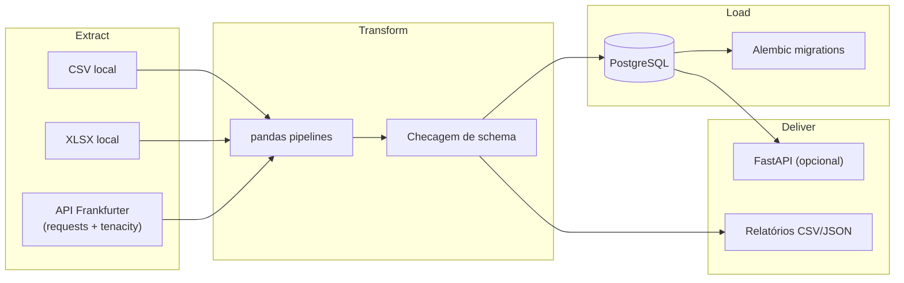

# ETL Financeiro Inteligente

Sistema demonstrativo pipeline ETL com múltiplas fontes, validação forte, PostgreSQL como destino analítico, relatórios (CSV + JSON), agendamento leve (`schedule`), API opcional (**FastAPI**), infraestrutura **Docker**, migrações **Alembic** e cobertura de testes (**pytest**) — sem credenciais no código.

## Visão de arquitetura

O projeto separa explicitamente responsabilidades (Clean Architecture pragmática + SOLID):

| Camada       | Pasta                         | Responsabilidade |
|-------------|-------------------------------|------------------|
| Configuração| `app/core/`                   | variáveis de ambiente (`pydantic-settings`), logging, agendadores |
| Integração  | `app/etl/extract/`            | leituras desacopladas (API, CSV, XLSX) + erros próprios |
| Transformação| `app/etl/transform/`         | pandas: limpeza, deduplicação, datas, métricas, validação |
| Persistência | `app/etl/load/`, `app/repositories/`, `app/models/` | ORM SQLAlchemy, transações deliberadas (`commit`/`rollback`) |
| Casos de uso| `app/services/`               | orquestra ETL completo + gera relatórios |
| Entrega HTTP | `app/api/`                   | expõe orquestração e snapshots de relatório |
| Observabilidade | `logs/` (rotativos INFO/ERROR) | rastrear batch, timings, contagens |



## Stack

- Python **3.12+** (compatível com versões mais novas onde existirem wheels)
- **pandas**, **requests**, **openpyxl**
- PostgreSQL **16** (`docker-compose`)
- SQLAlchemy **2.x** ORM + `psycopg2-binary`
- **Alembic** para DDL versionada
- **pytest** (+ marcador `@pytest.mark.integration`)
- **Docker** / **Compose**
- **schedule** para jobs diários (alternativa mais simples ao Celery)
- **FastAPI + Uvicorn** para acionar pipelines e relatórios
- **tenacity** (retry exponencial também no scheduler por job)
- **black** / **ruff** configurados via `pyproject.toml`

## Pré‑requisitos locais

- Python 3.12 ou superior instalado na máquina (recomendo `python -m venv .venv && source .venv/bin/activate`).
- Postgres acessível (local ou Docker) para executar cargas completas ou testes marcados como integração.

## Instalação local

```bash
python -m venv .venv
source .venv/bin/activate
pip install -r requirements.txt

cp .env.example .env
# Edite DATABASE_URL apontando para o seu Postgres
alembic upgrade head

python main.py run-etl
python main.py api        # servidor HTTP
python main.py scheduler  # mantém um loop dia-a-dia usando schedule + retry
```

## Docker / Compose

O `docker/backend-entry.sh` espera Postgres saudável, executa migrações e sobe (`api`, `scheduler` ou `run-etl`).

### Serviços no Compose

| Serviço | Profile Compose | Responsabilidade |
|---------|----------------|------------------|
| `postgres` | (padrão) | PostgreSQL 16 — host `localhost:5435` ↔ container `5432`. Healthcheck bloqueia o backend até `pg_isready` passar. |
| `backend` | (padrão) | Imagem da aplicação: `alembic upgrade head`, sobe FastAPI/Uvicorn na **8000** (JSON + Swagger + painel em `/`). Volumes `./logs`, `./reports`, `./data` (somente leitura). |
| `scheduler` | `cron` (`--profile cron`) | Mesma imagem; comando `scheduler` = `python main.py scheduler` para janelas diárias (`SCHEDULER_RUN_TIME`). |

```bash
docker compose up -d postgres backend
curl http://localhost:8000/health
curl -X POST http://localhost:8000/etl/run
```

Agendamento contínuo (perfil Compose `cron`, usa a mesma imagem):

```bash
docker compose --profile cron up -d scheduler
```

Volumes montados (`./logs`, `./reports`, `./data`) mantêm evidências fora dos containers sem colar dados sensíveis no repositório.

## Exemplos de uso

### Painel web (testes da API no navegador)

1. Suba **`postgres` + `backend`** (`docker compose up -d postgres backend`) ou `python main.py api` contra um Postgres válido (`DATABASE_URL` no `.env`).
2. Abra **`http://localhost:8000/`** — interface estática única (`app/static/dashboard.html`) que chama a mesma origem: `GET /health`, `POST /etl/run`, `GET /reports/snapshot`.
3. Swagger interativo permanece em **`http://localhost:8000/docs`**.

### CLI rápido

```bash
python main.py run-etl
```

Este comando registra métricas (FX + CSV + planilha) e gera automaticamente relatórios em `reports/` com carimbo determinístico de batch.

### API

1. Rode `python main.py api`.
2. `POST /etl/run` — executa o pipeline inteiro **e** atualiza relatórios.
3. `GET /reports/snapshot` — apenas materializa relatórios usando os dados já carregados nos últimos 7 dias configuráveis.
4. `GET /health` — verificação liveness-friendly.

### Fontes inclusas nos exemplos

- **API**: [Frankfurter](https://www.frankfurter.app/) (sem chave, ideal para demos).
- **CSV**: `data/samples/sample_quotes.csv`.
- **XLSX**: `data/samples/sample_portfolio.xlsx`.

## Diretório do projeto

```text
.
├── alembic/                # migrações versionadas (upgrade/downgrade auditável)
├── app/
│   ├── api/                # FastAPI (factory + routers + deps)
│   ├── static/dashboard.html  # Painel opcional mesmo host da API (/ e /static)
│   ├── core/               # configs, logging, scheduler runner
│   ├── db/                 # sessões SQLAlchemy e Base ORM
│   ├── models/             # FinancialMetric como fato núcleo
│   ├── repositories/       # consultas INSERT/UPSERT desacopladas
│   ├── services/           # orquestração ETL + reporting
│   ├── etl/                # extract / transform / load puros (SRP forte)
│   ├── utils/              # cliente HTTP resiliente / paths
│   └── tests/
│       ├── unit/           # pandas + schema sem infra externa obrigatória
│       └── integration/    # Postgres real (pulado se não houver servidor)
├── data/samples/           # massa de exemplo versionada sem segredos
├── docker/
│   ├── Dockerfile
│   └── backend-entry.sh
├── docker-compose.yml
├── logs/ reports/          # saídas operacionais (gitignored, exceto .gitkeep)
├── main.py                 # CLI oficial (scheduler, api, run-etl)
├── requirements.txt
└── README.md               # 📍 você está aqui
```

## Testes & qualidade

```bash
# unitários rápidos
pytest app/tests/unit

# integrações com Postgres disponível na DATABASE_URL atual
pytest app/tests/integration -m integration

# autofix rápido
ruff check app main.py scripts
black app main.py scripts
```

## Decisões técnicas destacadas

1. **Única fat table (`financial_metrics`)** com chave natural composta garante relatórios unificados e evolução futura (particionamentos, views materializadas) sem refactor massivo da extração multi-fonte.
2. **`PostgreSQL INSERT ... ON CONFLICT DO NOTHING`** encapsulado pelo repositório evita corrida duplicando FX diário ou reprocessamentos.
3. **Retry**: `requests` dentro de `ResilientHttpClient` usa `tenacity`; o mesmo padrão se repete no dispatcher diário garantindo recuperação mesmo após jitter de rede durante janelas de agendamento.
4. **Logging duplo arquivo** segrega níveis sem depender somente da console de containers headless — essencial quando o projeto roda apenas via Compose.
5. **FastAPI apenas como porta de operação**, não dentro do núcleo de domínio, mantém o mesmo pipeline consumível tanto por CLI quanto pelo HTTP gateway.
6. **`schedule`** reduz infraestrutura (sem broker) para cenários onde o SLA é batch diário; documentei claramente o trade-off contra Celery (escala horizontal/eventos).

---

**Licença & portfólio**: este projeto é auto-contido pensado como vitrine técnica. Ajuste amostragens, SLA e observabilidade (OpenTelemetry/Prometheus) conforme cenários específicos de produção corporativa.
