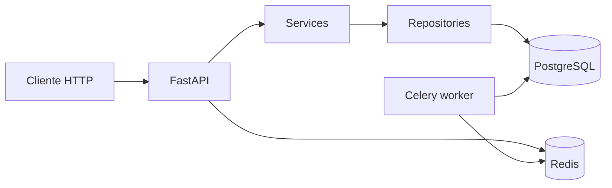

# Sistema Inteligente de Emissão de Minutas

Backend corporativo em **FastAPI** para geração e governança de minutas/contratos, com **PostgreSQL**, **Redis**, **Celery**, autenticação **JWT**, auditoria e preparação para **IA generativa** (OpenAI), templates **Jinja2** e pipeline de documentos (PDF, OCR).

> **Nota de repositório:** este código vive em `project/` para conviver com o legado **ETL-Financeiro** na raiz do repositório. Trabalhe sempre a partir do diretório `project/`.

## Visão geral

O sistema expõe APIs versionadas sob `/api/v1`, persiste dados em PostgreSQL com **SQLAlchemy 2 (async)** e **Alembic**, delega trabalho pesado a workers **Celery** e usa **Redis** como broker/backend. A **ETAPA 1** (atual) entrega arquitetura inicial, Docker, banco, autenticação completa (access JWT + refresh opaco persistido), auditoria básica e observabilidade de requisição (`X-Request-ID`).

## Arquitetura (clean + camadas)

| Camada | Responsabilidade |
|--------|-------------------|
| **api/** | HTTP, contratos OpenAPI, deps de auth/DB |
| **services/** | orquestração de caso de uso, transações de negócio |
| **repositories/** | persistência, queries, isolamento do ORM |
| **models/** | entidades e relações |
| **schemas/** | validação Pydantic (entrada/saída) |
| **core/** | config, segurança, logging, Celery app |
| **ai/** | (ETAPA 4) provedores e serviços de IA |
| **tasks/** | (ETAPA 5) tarefas assíncronas |

**Por quê assim?** Separação clara facilita testes (mock de repositório), evolução de regras sem acoplar HTTP ao ORM, e leitura parecida com codebases enterprise reais (menos “tudo no controller”).

### Fluxo (alto nível)



## Stack

- Python **3.12+** (recomendado; ambiente local também validado com 3.14 + **psycopg**)
- FastAPI, Pydantic, Uvicorn
- PostgreSQL, SQLAlchemy 2 async, **psycopg** (async) + **psycopg2** (migrations)
- Alembic, Redis, Celery
- JWT (access) + refresh **opaco** com hash (SHA-256) no banco
- bcrypt (senhas), tenacity (resiliência em chamadas externas — já preparado)
- Jinja2, OpenAI SDK, pdfkit/reportlab, pdfplumber, pytesseract (pipelines nas etapas seguintes)

**Decisão técnica — refresh opaco:** em ambientes bancários costuma-se priorizar **revogação** e **rotação** em vez de refresh JWT stateless. Guardamos só o hash do token e trocamos o par access/refresh no endpoint de refresh.

**Decisão técnica — psycopg vs asyncpg:** `asyncpg` é excelente, mas em Python muito novo pode não haver wheel pronto; **psycopg 3** integra bem ao SQLAlchemy async e simplifica o setup corporativo em imagens oficiais.

## Instalação local

```bash
cd project
python3 -m venv .venv
source .venv/bin/activate
pip install -r requirements.txt
pip install -r requirements-dev.txt   # opcional: ruff, black, mypy
cp .env.example .env                  # ajuste SECRET_KEY e URLs
```

Suba o PostgreSQL local (ou use Docker apenas para o banco) e aplique migrações:

```bash
alembic upgrade head
uvicorn app.main:app --reload --host 0.0.0.0 --port 8000
```

Documentação interativa: `http://localhost:8000/docs` (desativada em `ENVIRONMENT=production`).

## Docker

```bash
cd project
docker compose up --build
```

- API: `http://localhost:8010`
- Postgres host: porta **5437** (mapeada para 5432 no container)
- Redis host: porta **6380**

O entrypoint da API roda `alembic upgrade head` antes do Uvicorn. O worker Celery usa outro **entrypoint** (sem migrar toda subida — padrão comum; migrações ficam no serviço `app`).

## Endpoints principais (ETAPA 1)

| Método | Caminho | Descrição |
|--------|---------|-----------|
| GET | `/api/v1/health` | Liveness |
| GET | `/api/v1/ready` | Readiness simplificado |
| POST | `/api/v1/auth/register` | Registro (primeiro usuário vira **admin**) |
| POST | `/api/v1/auth/login` | Login — retorna access + refresh |
| POST | `/api/v1/auth/refresh` | Renova access + refresh (rotação) |
| GET | `/api/v1/auth/me` | Perfil do usuário autenticado |
| GET | `/api/v1/auth/admin/ping` | Exemplo de rota **admin-only** (RBAC) |

## Estrutura de pastas (`project/`)

```
project/
├── app/
│   ├── api/              # rotas e dependencies
│   ├── core/             # config, security, logger, celery_app
│   ├── db/               # engine, sessão, Base
│   ├── models/           # ORM
│   ├── schemas/          # Pydantic
│   ├── repositories/     # acesso a dados
│   ├── services/         # casos de uso
│   ├── ai/               # (próximas etapas)
│   ├── templates/        # Jinja2
│   ├── tasks/            # Celery tasks (a expandir)
│   ├── utils/            # helpers
│   ├── tests/
│   └── main.py
├── uploads/
├── generated_documents/
├── logs/
├── docker/
├── alembic/
├── docker-compose.yml
├── requirements.txt
├── requirements-dev.txt
├── .env.example
└── README.md
```

## Testes e qualidade

```bash
cd project
source .venv/bin/activate
pytest
ruff check app
black --check app
mypy app
```

## Segurança (curto prazo vs produção)

**Já presente:** hashing de senha (bcrypt), JWT assinado, refresh com hash + rotação, segregação básica de papéis (`admin` / `editor` / `viewer`), auditoria de eventos de autenticação, correlação `X-Request-ID`.

**Próximos passos típicos de banco:** rate limiting (API gateway ou middleware), política de senha corporativa, MFA, rotação de `SECRET_KEY` com overlap, armazenamento de segredos em vault, **WAF**, mTLS interno entre serviços, hardening de headers e `Forwarded` confiável somente atrás de proxy conhecido.

## Performance e escala

- API **stateless** → escala horizontal atrás de load balancer.
- Pool de conexões SQLAlchemy + `pool_pre_ping` (recomendado revisar tamanho do pool por processo).
- **Redis** já separado para Celery; pode evoluir para cache de leitura ou bloqueio distribuído.
- Jobs pesados (PDF, OCR, e-mail, IA) devem permanecer em **Celery** para não bloquear o event loop da API.

## Melhorias futuras (roadmap das etapas)

1. **ETAPA 2:** CRUDs de clientes e contratos/minutas com versionamento.
2. **ETAPA 3:** motor Jinja2 + exportação PDF + armazenamento versionado de artefatos.
3. **ETAPA 4:** camada `ai/providers` + `ai/services` com timeouts/retries e fallback.
4. **ETAPA 5:** filas para todas as operações pesadas; dead-letter e retries idempotentes.
5. **ETAPA 6:** upload, pdfplumber + OCR (tesseract), parser resiliente.
6. **ETAPA 7:** suíte ampla de testes (integração com DB de teste / Testcontainers).
7. **ETAPA 8:** hardening, observabilidade avançada (métricas/tracing), políticas de retenção LGPD.

---

Licença: ajuste conforme o repositório pai. Este módulo segue o estilo de código solicitado: comentários somente onde agregam contexto de negócio ou limitações conscientes.
